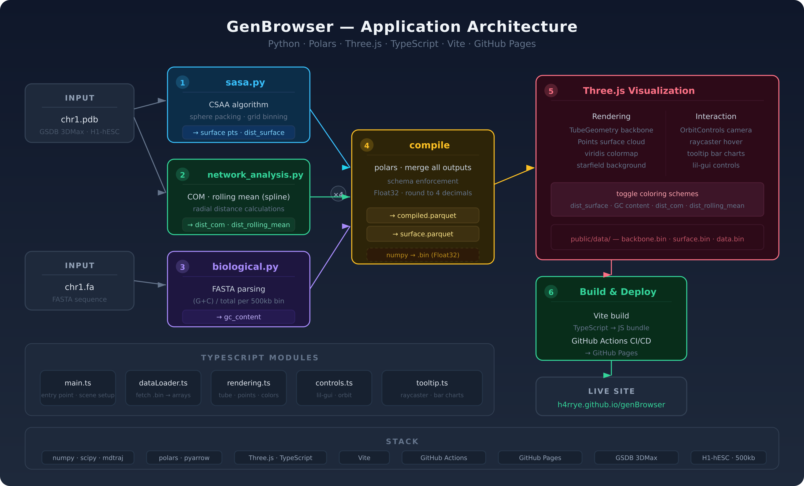

# GenBrowser

Interactive 3D chromosome visualization dashboard mapping biological and physical metrics onto a chromosome 1 structural model. Built with Three.js and TypeScript, deployed on GitHub Pages.

**[Live Demo](https://h4rrye.github.io/genBrowser/)**

## About

This project visualizes human chromosome I along with various biological properties and physical attributes. It calculates the **Chromosome Surface Accessible Area (CSAA)** around the chromosome to study open/closed chromatin regions and their relationship to biological functions — a proposed alternative to ATAC-Seq.

The CSAA algorithm is derived from protein **Solvent Accessible Surface Area (SASA)**, adapted to study chromatin accessibility at 500kb resolution using 3D chromosome structures from GSDB.

## Architecture

[](docs/imgs/genbrowser_architecture.png)

## Data Processing

Four Python scripts process the raw PDB structure into visualization-ready binary files:

**sasa.py** — Constructs the chromosome surface using sphere packing and grid binning. Computes distance from surface for each genomic bin (CSAA algorithm).

**network_analysis.py** — Calculates center of mass and rolling mean spline. Computes distance from COM and distance from rolling mean for each bead.

**biological.py** — Parses chromosome FASTA file and calculates GC content per 500kb bin.

**compile** — Merges all four outputs using Polars with schema enforcement. Exports compiled data and surface points as Parquet, then converts to Float32 `.bin` files for WebGL performance.

## Visualization

The Three.js frontend loads the binary data and renders an interactive 3D scene with:

- Chromosome backbone as a tube geometry with viridis coloring
- Toggleable surface point cloud
- Four coloring schemes: distance to surface, GC content, distance to COM, distance to rolling mean
- Hover tooltips with per-bead bar charts
- OrbitControls camera and lil-gui control panel

## Data Source

3D chromosome structure from [GSDB](https://calla.rnet.missouri.edu/genome3d/GSDB/) — 3DMax reconstruction of H1-hESC (GSE105544), 500kb resolution.

## Stack

Python, NumPy, SciPy, mdtraj, Polars, Three.js, TypeScript, Vite, GitHub Actions, GitHub Pages

## Getting Started

```bash
# Frontend
cd visualization/threejs-vite-typescript
npm install
npm run dev
```

## License

MIT
